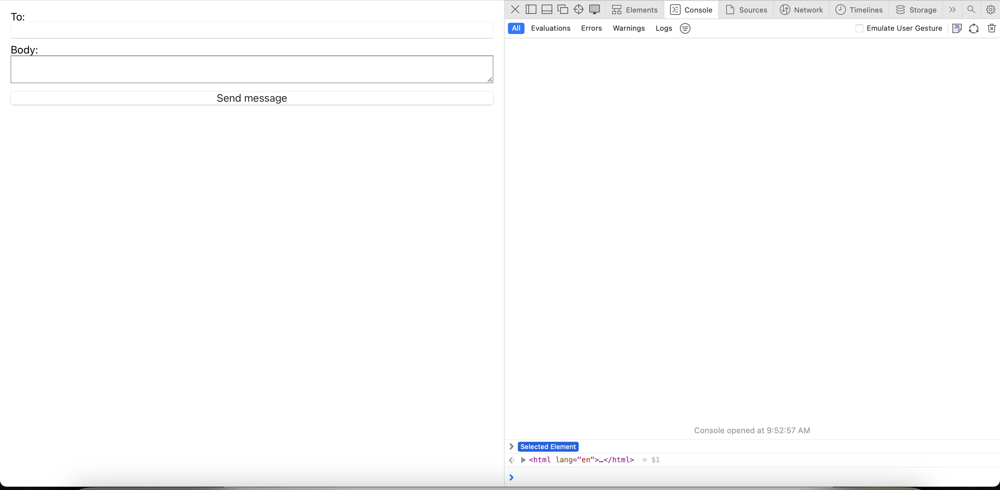

# MERN Twilio SMS Starter Template

This is a starter template for sending Message using Twilio and MERN stack.

## Tools and Versions

- `npx create-react-app`: 5.0.1
- `node`: v20.13.0
- `npm`: 10.5.2
- `npx`: 10.5.2

## Firebase Setup

1. **Follow Video Instructions**: Watch the provided video guides (setupTwilio.mp4) in repository for step-by-step instructions.

   <div style="display:flex;">
       <video width="400" height="300" controls>
           <source src="setupTwilio.mp4" type="video/mp4">
           Your browser does not support the video tag.
       </video>
   </div>
   
## Demo Images




## Setup Instructions
 
1. Clone the repository:
    ```bash
    git clone https://github.com/AppAnySite/BBlocks.git
    ```

2. Navigate to the project directory:
    ```bash
    cd BBlocks/MERN-Twilio-App
    ```

3. Install dependencies:
    ```bash
    npm install
    ```


## Running the Application

- To start the Application:
    ```bash
    npm run dev
    ```
