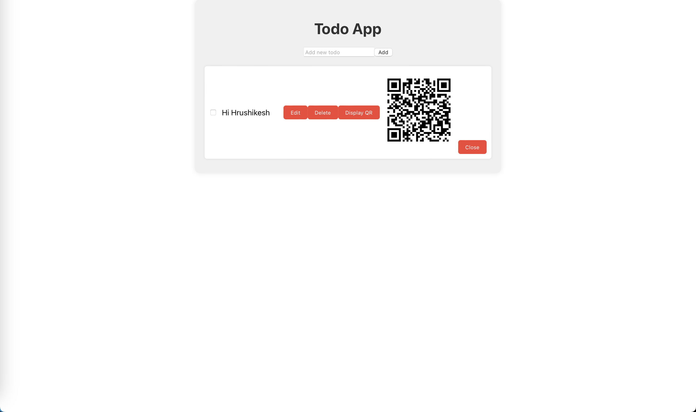
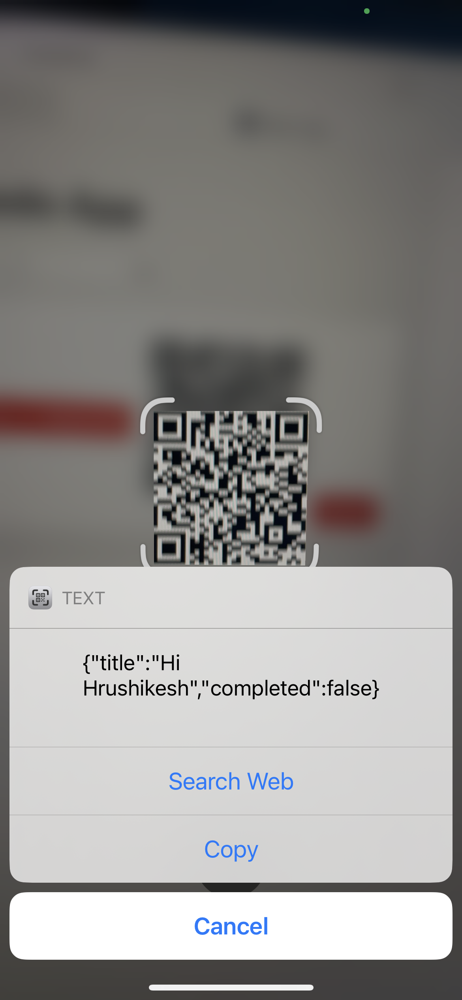

# QRCODE Generator MERN Starter Template

This is a starter template for building applications using React for the frontend, Node.js with Express for the backend, and MongoDB for the database.

## Tools and Versions

- `npx create-react-app`: 5.0.1
- `node`: v21.7.1
- `npm`: 10.5.0
- `npx`: 10.5.0
  
## Demo Images





## Setup Instructions
 
1. Clone the repository:
    ```bash
    git clone https://github.com/AppAnySite/BBlocks.git
    ```

2. Navigate to the project directory:
    ```bash
    cd BBlocks/QRCodeGenerator-MERN
    ```

3. Install dependencies for the client:
    ```bash
    cd client && npm install
    ```

4. Install dependencies for the backend:
    ```bash
    cd ../backend && npm install
    ```

5. Go to the backend directory:
    ```bash
    cd backend
    ```

6. Replace the placeholder `<username>`, `<password>`, and `<cluster_name>` in the `DB_CONNECTION_STRING` environment variable with your own MongoDB connection string. Open the `.env` file and update the following line:
    ```
    DB_CONNECTION_STRING=mongodb+srv://<username>:<password>@<cluster_name>/TodoApp
    ```

## Running the Application

- To start the frontend (React) development server:
    ```bash
    cd client && npm start
    ```

- To start the backend (Node.js with Express) server:
    ```bash
    cd backend && npm start
    ```

## Folder Structure

- `client`: Contains the React frontend code.
- `backend`: Contains the Node.js backend code.
