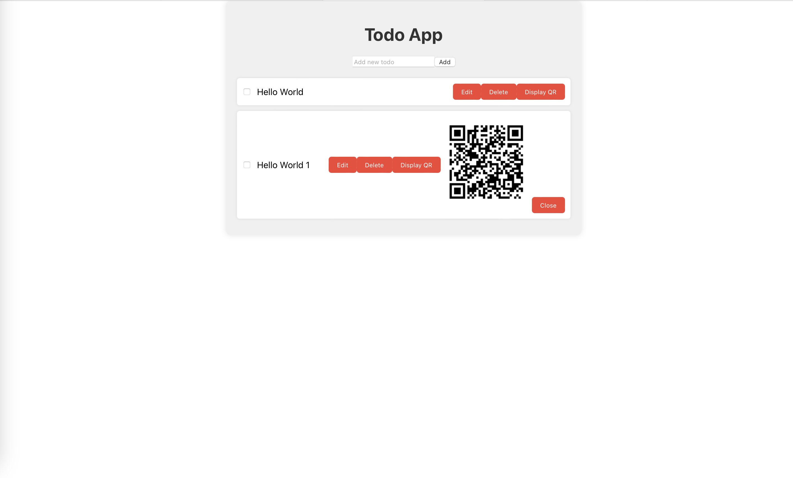
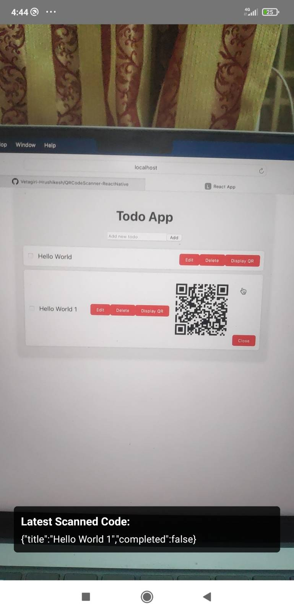
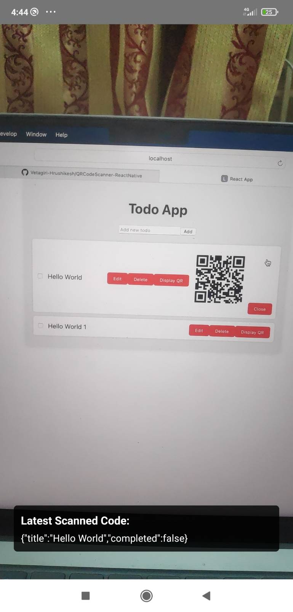

# QRCodeScanner-ReactNative Starter Template

This is a starter template for a QRCode Scanner Application in React Native.

## Demo

### Android





## Setup Instructions

1. Clone the repository:

    ```bash
    git clone https://github.com/AppAnySite/BBlocks.git
    ```

2. Navigate to the project directory:

    ```bash
    cd BBlocks/QRCodeScanner-ReactNative
    ```

3. Install dependencies for the application:

    ```bash
    npm install
    ```

## Running the Application

4. Connect your Android Device (Make sure developer options and USB Debugging is enabled).

5. Start the development server:

    ```bash
    npx react-native start
    ```

6. Run on Android:

    Press `a` to run the application on your connected Android device.

7. Scan the QR Code:

    Use your Android device to scan the QR code.

## Folder Structure

- `client`: Contains the React frontend code.
- `backend`: Contains the Node.js backend code.
