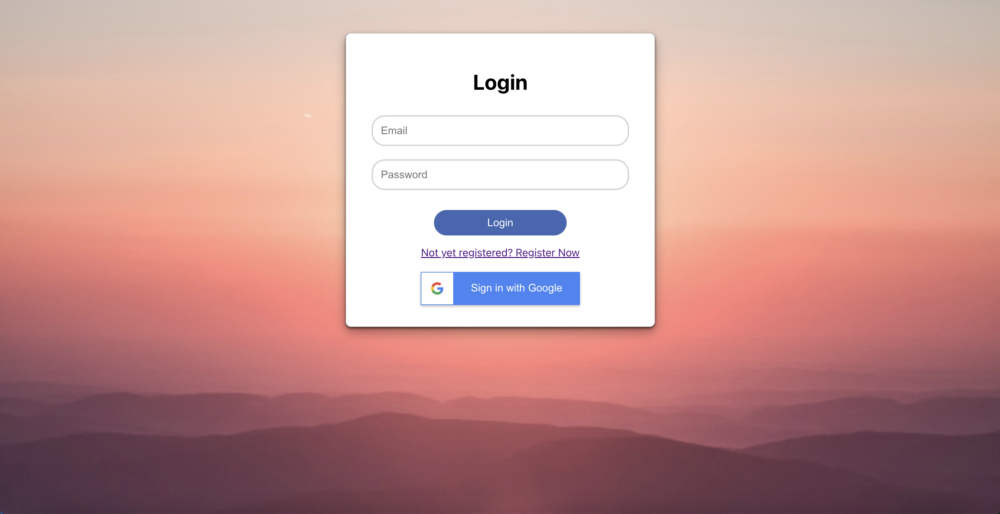
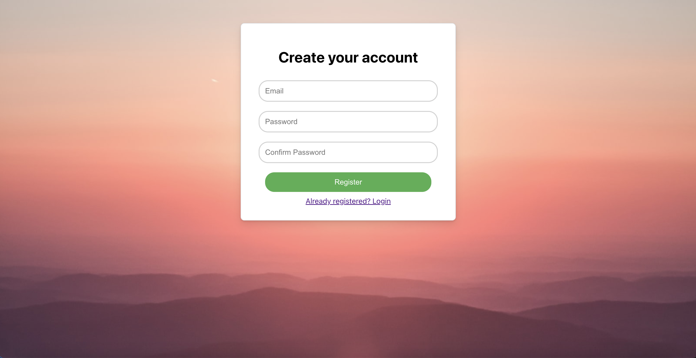

# React Email and Google Firebase Auth Starter Template

This is a starter template for React Firebase Authentication using Email and Google.

## Tools and Versions

- `npx create-react-app`: 5.0.1
- `node`: v20.13.0
- `npm`: 10.5.2
- `npx`: 10.5.2
  
## Demo Images





## Setup Instructions
 
1. Clone the repository:
    ```bash
    git clone https://github.com/AppAnySite/BBlocks.git
    ```

2. Navigate to the project directory:
    ```bash
    cd BBlocks/React-Firebase-auth
    ```

3. Install dependencies:
    ```bash
    npm install
    ```

4. Replace your firebase details in src/firebase-config.js:
    ```bash
    const firebaseConfig = {
    apiKey: "FIREBASE_API_KEY",
    authDomain: "FIREBASE_AUTH_DOMAIN",
    projectId: "FIREBASE_PROJECTID",
    storageBucket: "FIREBASE_STORAGE_BUCKET",
    messagingSenderId: "FIREBASE_MESSAGE_SENDER_ID",
    appId: "FIREBASE_APPID",
    measurementId: "FIREBASE_MEASURMENT"
  };
    ```

## Running the Application

- To start the Application:
    ```bash
    npm start
    ```
