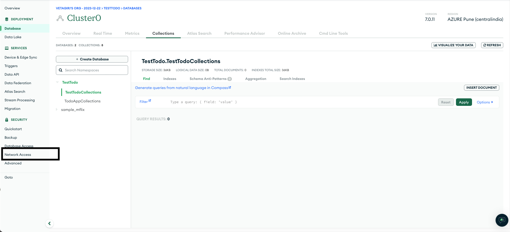
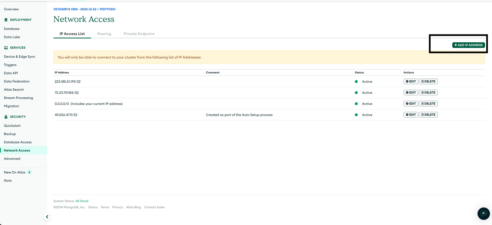
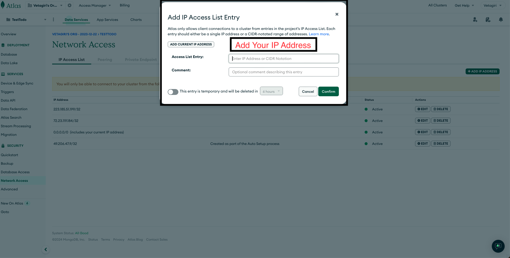

# React-Node-Express-Mongo Starter Template

This is a starter template for building applications using React for the frontend, Node.js with Express for the backend, and MongoDB for the database.

## Tools and Versions

- `npx create-react-app`: 5.0.1
- `node`: v21.7.1
- `npm`: 10.5.0
- `npx`: 10.5.0


## Setting Up MongoDB Database with MongoDB Atlas

### Prerequisites

- Access to the internet
- Google account (for signing in to MongoDB)

## Steps

1. **Visit MongoDB.com**: Go to [MongoDB.com](https://www.mongodb.com/) in your web browser.

2. **Sign In or Sign Up**: Click on the "Sign In" button and sign in using your Google account. If you don't have an account, you can sign up for free.

3. **Accept Terms and Conditions**: After signing in, accept the privacy and terms.

4. **Fill out Atlas Questionnaire**: Answer questions about your primary goal, experience with MongoDB, programming language, types of data your project will use, and architectural models.

5. **Deploy Your Database**: Choose the free version, any provider, and customize the cluster name if desired. Click on "Create Deployment" to proceed.

6. **Create Database User**: You will be redirected to "Connect to Cluster" page automatically, create a database user, and note down the credentials provided.

7. **Choose a Connection Method**: Select "Drivers" as the connection method and store the connection string provided.

8. **Review Setup Steps**: Confirm that all steps are completed, then click on "Done" to proceed.

9. **Wait for Cluster to be Ready**: Wait for some time until your cluster is ready. You'll receive a notification when it's ready.

10. **Access Dashboard**: Once the cluster is ready, you'll be redirected to the dashboard. Wait for the browser collections to load, then click on it.

11. **Create Database**: On the cluster page, click on "Create Database", enter the desired database name and collection name, and optionally select additional preferences such as creating a capped collection. Click on "Create" to create the database.

12. **Store Information**: Store all the relevant information, including database credentials and connection string, in a secure location or README.md file for future reference.


## Project Setup Instructions
 
1. Clone the repository:
    ```bash
    git clone https://github.com/AppAnySite/BBlocks.git
    ```

2. Navigate to the project directory:
    ```bash
    cd BBlocks/React-Node-Express-Mongo
    ```

3. Install dependencies for the client:
    ```bash
    cd client && npm install
    ```

4. Install dependencies for the backend:
    ```bash
    cd ../backend && npm install
    ```

5. Go to the backend directory:
    ```bash
    cd backend
    ```

6. Replace the placeholder `<username>`, `<password>`, and `<cluster_name>` in the `DB_CONNECTION_STRING` environment variable with your own MongoDB connection string. Open the `.env` file and update the following line:
    ```
    DB_CONNECTION_STRING=mongodb+srv://<username>:<password>@<cluster_name>.en4xmvp.mongodb.net/<Database_name>?retryWrites=true&w=majority&appName=<cluster_name>
    ```

## Running the Application

- To start the frontend (React) development server:
    ```bash
    cd client && npm start
    ```

- To start the backend (Node.js with Express) server:
    ```bash
    cd backend && npm start
    ```

## Running the Application using Docker

- To start the frontend (React) development server:
    ```bash
    cd client && docker build -t client . && docker run -it -p 3000:3000 client
    ```

- To start the backend (Node.js with Express) server:
    ```bash
    cd backend && docker build -t server . && docker run -it -p 5050:5050 server
    ```
## Running the Application using Docker

- If you are facing any issues in MongoDB Connectivity:
    ```bash
    Make sure that you add your IP Address by following the below steps
    ```

- To start the backend (Node.js with Express) server:
    ```bash
    cd backend && docker build -t server . && docker run -it -p 5050:5050 server
    ```
## Folder Structure

- `client`: Contains the React frontend code.
- `backend`: Contains the Node.js backend code.

## Issues


<div style="display: flex;">
    
    
    
</div>

