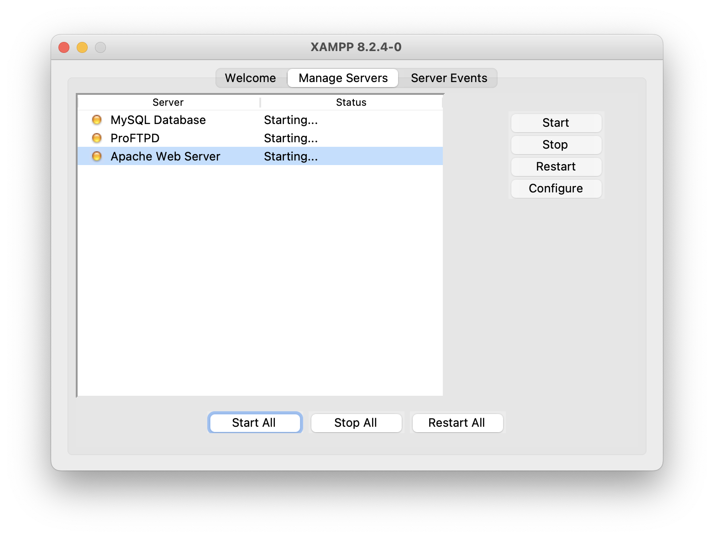
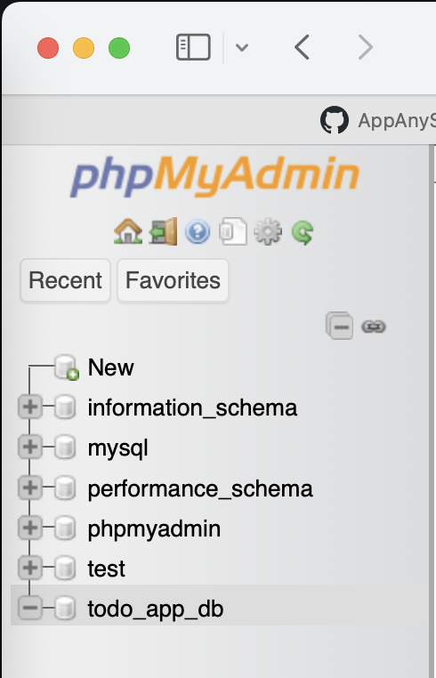

# React-Node-Express-MySQL Starter Template

This is a starter template for building applications using React for the frontend, Node.js with Express for the backend, and MySQL for the database.

## Setup Instructions

1. Clone the repository:
    ```bash
    git clone https://github.com/AppAnySite/BBlocks.git
    ```

2. Navigate to the project directory:
    ```bash
    cd BBlocks/React-Node-Express-MySQL
    ```

3. Install dependencies for the client:
    ```bash
    cd client && npm install
    ```

4. Install dependencies for the backend:
    ```bash
    cd ../backend && npm install
    ```

5. Go to the backend directory:
    ```bash
    cd backend
    ```

## Running the Application

6. Install XAMPP from [this URL](https://www.apachefriends.org/download.html). After installation, run all servers in XAMPP. Below is an example image showing how to run all servers:

   

7. Create a database in MySQL. For example, you can create a database named `todo_app_db`. Below is an example image showing how to create a database:

   

8. Replace the placeholder `<username>`, `<password>`, `<hostname>`, and `<database_name>` in the `.env` file with your own MySQL connection details. Open the `.env` file which is inside `backend/` folder and update the following lines:
    ```
    DB_HOST=HOSTNAME
    DB_USER=USERNAME
    DB_PASSWORD=PASSWORD
    DB_NAME=DATABASENAME
    ```

- To start the frontend (React) development server:
    ```bash
    cd client && npm start
    ```

- To start the backend (Node.js with Express) server:
    ```bash
    cd backend && npm start
    ```

## Folder Structure

- `client`: Contains the React frontend code.
- `backend`: Contains the Node.js backend code.