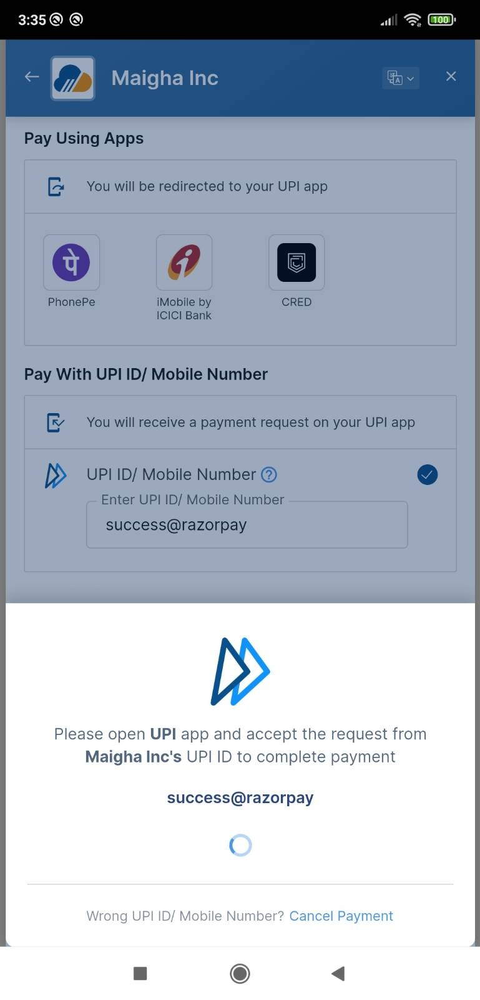

# ReactNative Razorpay Starter Template

This is a starter template for building application using ReactNative for integration of Payment Gateway using Razorpay

## Demo

### Android

<div style="display: flex;">
    
    
    
    
    
    
    
</div>


## Setup Instructions

1. Clone the repository:
    ```bash
    git clone https://github.com/AppAnySite/BBlocks.git
    ```

2. Navigate to the project directory:
    ```bash
    cd BBlocks/ReactNative-RazorPay
    ```

3. Install dependencies for the client:
    ```bash
    npm install
    ```

## Running the Application

4. Connect your Android Device (Make sure developer options and USB Debugging is enabled).

5. Start the development server:

    ```bash
    npx react-native start
    ```

6. Run on Android:

    Press `a` to run the application on your connected Android device.

7. Scan the QR Code:

    Use your Android device to scan the QR code.

## UPI IDs

You can use the following UPI IDs to simulate payments:

- success@razorpay: To make the payment successful.
- failure@razorpay: To fail the payment.

## Test Cards

You can use the following test cards to simulate transactions:

### Domestic Cards

#### Mastercard
- Card Number: 5267 3181 8797 5449

#### Visa
- Card Number: 4111 1111 1111 1111

### International Cards

#### Mastercard
- Card Number: 5555 5555 5555 4444

#### Visa
- Card Number: 4012 8888 8888 1881

### Expiry Date and CVV
- Use any valid expiration date in the future in the MM/YY format.
- Use any random CVV to create a successful payment.
